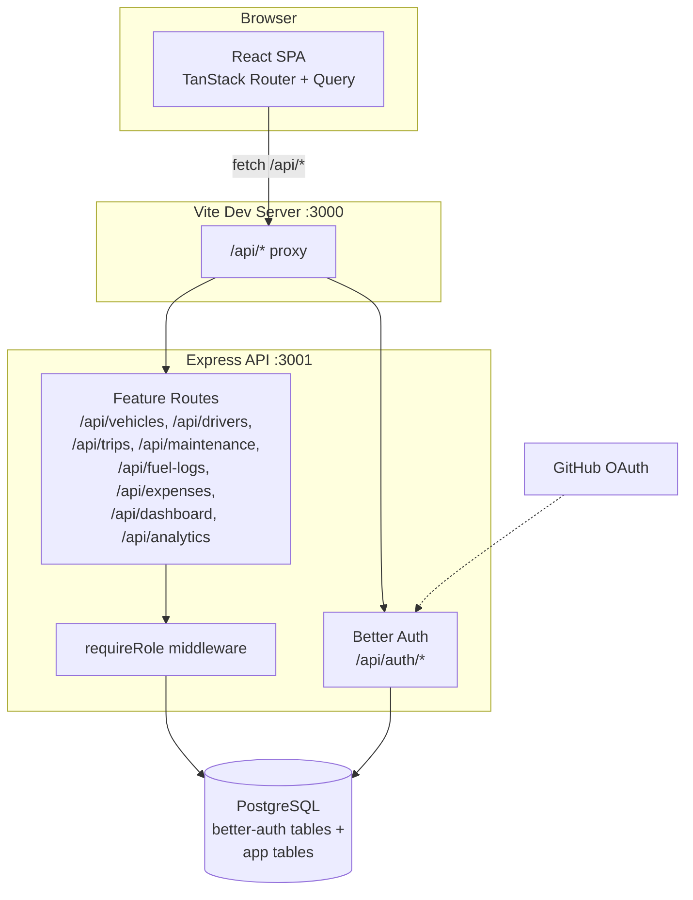
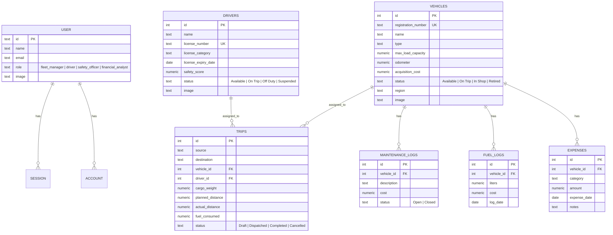
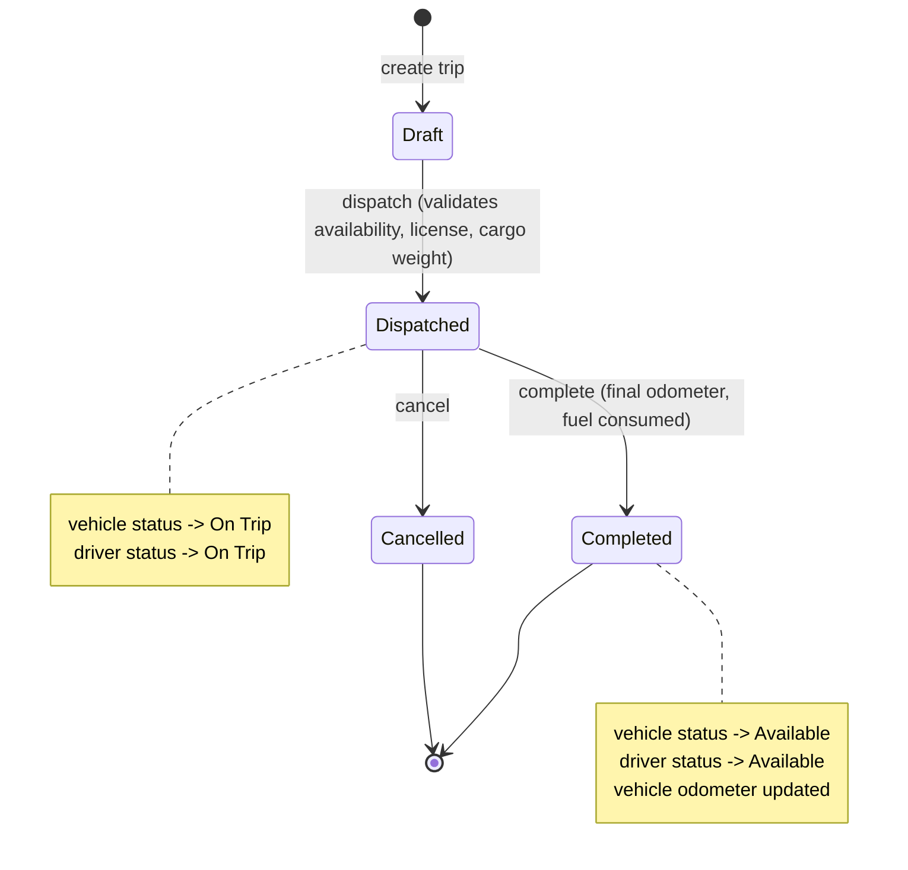

# TransitOps — Smart Transport Operations Platform

**Odoo Hackathon 2026** — a fleet operations platform for managing vehicles, drivers, trips, maintenance, fuel/expenses, and analytics from a single dashboard.

## Scope

TransitOps helps a fleet operator run day-to-day logistics:

- **Fleet Registry** — track vehicles (registration, type, load capacity, odometer, acquisition cost, status, photo).
- **Driver Management** — roster with license category/expiry tracking and safety score.
- **Trip Dispatch** — create, dispatch, complete, and cancel trips with business-rule validation (cargo weight vs. vehicle capacity, vehicle/driver availability, license expiry checks).
- **Maintenance** — open/close maintenance records; vehicle status automatically flips to `In Shop` / `Available`.
- **Fuel & Expenses** — per-vehicle fuel logs and general expenses.
- **Analytics** — fuel efficiency, operational cost, and ROI per vehicle, with charts and CSV export.
- **Dashboard** — fleet-wide KPIs (utilization, active/pending trips, drivers on duty) and a trip-volume trend chart.
- **Auth & RBAC** — email/password and GitHub OAuth login, four roles (`fleet_manager`, `driver`, `safety_officer`, `financial_analyst`) gating write access.
- **Search** — Postgres full-text (prefix) search across vehicles, drivers, trips, maintenance, and expenses.
- **Settings** — profile (name, avatar), password change, dark/light theme.

Out of scope for this build: route optimization/GPS tracking, payments/invoicing, multi-tenant orgs, native mobile apps.

## Tech Stack

| Layer | Stack |
|---|---|
| Frontend | React 19, Vite, TanStack Router (file-based routing), TanStack Query, Tailwind CSS v4, shadcn/ui (base-ui), Recharts |
| Backend | Node.js, Express 5, Better Auth (email/password + GitHub OAuth, RBAC via `additionalFields`) |
| Database | PostgreSQL — raw `pg` driver, no ORM, hand-written SQL migrations |
| Auth | Better Auth (cookie sessions, GitHub OAuth account linking, CLI-managed schema for auth tables) |

## Architecture



**Notes:**
- Frontend and backend are separate packages (`frontend/`, `backend/`) with independent `package.json`s; Vite proxies `/api` to the Express server in dev.
- A single shared `pg.Pool` (`backend/db.js`) is used by Better Auth and every feature route — no ORM, plain parameterized `pool.query(...)`.
- `requireRole(...roles)` reads the Better Auth session and gates write endpoints per role; read endpoints are open to any authenticated user.
- Better Auth's own tables (`user`, `session`, `account`, `verification`) are schema-managed via `@better-auth/cli`; app tables are managed by hand-written migrations in `backend/migrations/`.

## Database Schema



## Trip Lifecycle



## Role-Based Access Control

| Role | Read access | Write access |
|---|---|---|
| `fleet_manager` | Everything | Everything |
| `safety_officer` | Everything | Drivers, Maintenance |
| `financial_analyst` | Everything | Fuel Logs, Expenses |
| `driver` | Everything | — (read-only) |

All list/read endpoints are open to any authenticated user; write endpoints are gated with `requireRole(...roles)`.

## Project Structure

```
backend/
  auth.js              Better Auth config (email/password, GitHub OAuth, RBAC field)
  db.js                Shared pg.Pool
  index.js             Express app — mounts auth + all feature routers
  middleware/
    requireRole.js      Role-gate middleware
  migrations/           Hand-written SQL for app tables
  better-auth_migrations/  CLI-generated SQL for auth tables
  routes/               vehicles, drivers, trips, maintenance, fuel, expenses,
                         dashboard, analytics — one file per resource
  lib/
    search.js            Postgres prefix full-text search helper
    mailer.js             Transactional email (Resend)

frontend/
  src/
    routes/_protected/    One file per page (file-based routing)
    hooks/                 One TanStack Query hook file per resource
    components/            Shared UI (shadcn/ui + app-specific)
    lib/                    format.ts (currency/date), auth-client.ts, utils.ts
```

## Getting Started

```bash
# Backend
cd backend
pnpm install
pnpm dlx @better-auth/cli generate -y     # apply auth schema (role field)
psql "$POSTGRESQL_URL" -f migrations/001_app_tables.sql
psql "$POSTGRESQL_URL" -f migrations/002_add_images.sql
pnpm dev                                   # http://localhost:3001

# Frontend
cd frontend
pnpm install
pnpm dev                                   # http://localhost:3000
```

Requires a `.env` in `backend/` with `POSTGRESQL_URL`, `BETTER_AUTH_SECRET`, `BETTER_AUTH_URL`, and optionally `GITHUB_CLIENT_ID`/`GITHUB_CLIENT_SECRET` for OAuth and `RESEND_API_KEY` for transactional email.
